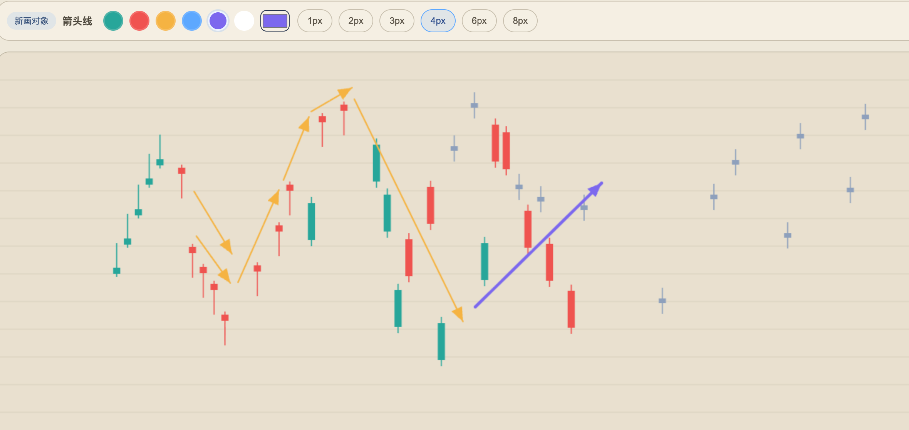

# AI KLine

一个面向 `K 线标注 / 走势推演 / 平板绘图` 场景的交互式画板项目。  
当前提供：

- `Web` 版：基于 `Vue 3 + Vite`
- `Android Pad APK`：基于 `Capacitor`
- `Windows / macOS` 桌面封装产物

这个项目的目标不是做一个普通白板，而是尽量把 `K 线对象`、`趋势线`、`箭头线`、`文字标注`、`时间轴 / 价格轴` 放在同一个可编辑画布里，做出更接近专业 K 线标注软件的使用体验。

## Features

- 单根 K 线插入与编辑
- 常见 K 线组合快速插入
- 自定义 K 线实体、上影、下影、颜色
- 趋势线、直线、箭头线、斐波那契绘制
- 线条支持颜色、宽度、复制、删除
- 文字就地插入、重编辑、删除
- 工作区 / 多画布页签保存
- 图片导出
- Android Pad 适配
- 多语言切换
  - 简体中文
  - 繁體中文
  - English
  - 한국어
  - 日本語
- 日内 / 高周期时间轴展示
  - `09:00 - 16:00`
  - `09:00 - 15:00`
- 高周期视图与时间轴缩放联动

## Screens

当前主入口：

- Web: `/chart`
- 默认本地开发地址：[http://localhost:8080/chart](http://localhost:8080/chart)

## Tech Stack

- `Vue 3`
- `TypeScript`
- `Vite`
- `Vue Router`
- `Capacitor Android`
- `Go` 桌面启动器

## Project Structure

```text
.
├── client-vue/                 # Web 主项目 + Android Capacitor 工程
│   ├── src/
│   │   ├── views/
│   │   │   └── KLineProPage.vue
│   │   ├── components/
│   │   ├── utils/
│   │   └── main.ts
│   ├── android/                # Android 原生壳
│   ├── capacitor.config.ts
│   ├── vite.config.ts
│   └── package.json
├── desktop-launcher/           # Windows / macOS 桌面启动器
├── ai-kline-pad-debug.apk      # 已打包的 Android 调试包
├── ai-kline-web.exe            # 已打包的 Windows 启动器
├── ai-kline-macos-arm64.dmg    # 已打包的 macOS 安装包
└── ai-kline-macos-arm64.pkg    # 已打包的 macOS 安装包
```

## Quick Start

### 1. Install dependencies

```bash
cd client-vue
npm install
```

### 2. Run Web

```bash
npm run dev
```

默认启动在：

- [http://localhost:8080](http://localhost:8080)
- 页面入口会自动跳到 `/chart`

### 3. Build Web

```bash
npm run build
```

构建输出：

```text
client-vue/dist/
```

## Android APK Build

### Prerequisites

- Node.js 18+
- npm
- JDK 17 或 21
- Android SDK

### Build steps

```bash
cd client-vue
npm run build
npm run cap:sync
cd android
./gradlew assembleDebug
```

或者直接使用项目里现成脚本：

```bash
cd client-vue
npm run android:build:debug
```

APK 输出位置：

```text
client-vue/android/app/build/outputs/apk/debug/app-debug.apk
```

根目录也通常会保留一份拷贝：

```text
ai-kline-pad-debug.apk
```

## Desktop Packaging

### Windows

桌面启动器目录：

```text
desktop-launcher/
```

可参考：

```bash
cd desktop-launcher
./build-win.sh
```

产物示例：

```text
ai-kline-web.exe
```

### macOS

可参考：

```bash
cd desktop-launcher
./build-mac.sh
```

产物示例：

```text
AI KLine Web.app
ai-kline-macos-arm64.dmg
ai-kline-macos-arm64.pkg
```

## Main Routes

| Route | Description |
|---|---|
| `/` | 重定向到 `/chart` |
| `/chart` | 主绘图页面 |
| `/settings` | 设置页 |

## Core Interaction Design

这个项目当前的交互设计重点有几条：

- `选择模式` 负责编辑已有对象
- `绘图模式` 负责创建新对象
- 线条支持：
  - 点中后直接拖端点调整
  - 拖线身整体移动
  - 就地颜色 / 粗细 / 复制 / 删除
- K 线支持：
  - 点中实体后直接编辑
  - 上下拖动位置
  - 调实体 / 上影 / 下影 / 颜色
- 文字支持：
  - 点击空白处插入
  - 点击已有文字重新编辑
  - 删除 / 修改大小

## Localization

当前内置语言：

- `zh-Hans`
- `zh-Hant`
- `en`
- `ko`
- `ja`

## Android Config Notes

当前 Android 壳做了几项适合平板的配置：

- `hardwareAccelerated=true`
- `largeHeap=true`
- `resizeableActivity=true`
- `windowSoftInputMode=adjustResize`

配置文件：

- `client-vue/android/app/src/main/AndroidManifest.xml`

## Development Notes

主要开发文件：

- `client-vue/src/views/KLineProPage.vue`
- `client-vue/src/main.ts`
- `client-vue/vite.config.ts`
- `client-vue/capacitor.config.ts`
- `desktop-launcher/main.go`

## Current Artifacts

仓库当前已经有这些现成产物：

- Android APK: `ai-kline-pad-debug.apk`
- Windows EXE: `ai-kline-web.exe`
- macOS DMG: `ai-kline-macos-arm64.dmg`
- macOS PKG: `ai-kline-macos-arm64.pkg`

## Roadmap

后续还适合继续往这些方向打磨：

- 更接近专业行情软件的时间轴 / bar spacing 模型
- 更完整的交易日历逻辑
- 更强的对象管理
  - 锁定
  - 隐藏
  - 图层顺序
- 更稳定的 Pad 手势交互
- Release 签名包与自动化打包

## License

如果你准备公开仓库，建议补一个明确的 `LICENSE` 文件。  
当前仓库里还没有看到单独的许可证声明。
